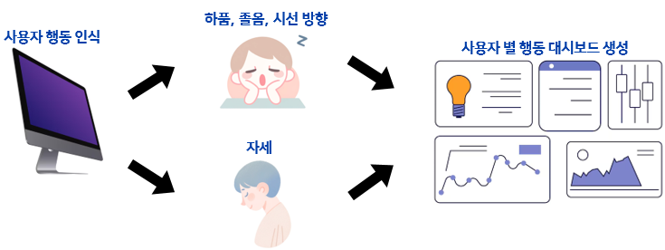
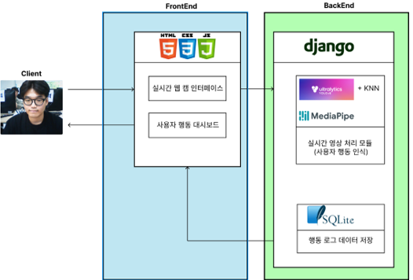
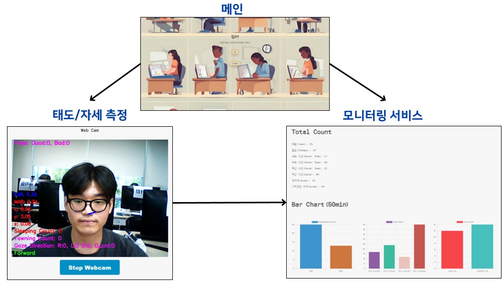

# 집PT
집중력의 '집' + 개인 트레이닝의 'PT'

## Team members
김승민 신나라 이지원  
임지원 조수환 조원진  

## Purpose
1. 사용자 상태 및 자세 모니터링 서비스  
   웹캠과 딥러닝을 활용해 학생들의 수업 태도를 모니터링하여 집중력, 졸음, 자세 파악
2. 학습 집중도를 향상
3. 올바른 학습 자세를 유도  

## Development Environment
Python, OpenCV, Yolov8, MediaPipe  
Webcam, Pycharm, Jupyter Notebook  

## Project Architecture

## Web Application

